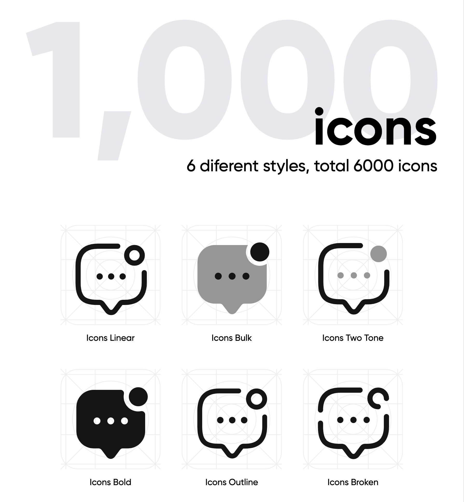

# Blade Iconsax

<p align="center">
    
</p>

<p align="center">
    <a href="https://github.com/saade/blade-iconsax/actions?query=workflow%3ATests">
        
    </a>
    <a href="https://packagist.org/packages/saade/blade-iconsax">
        
    </a>
    <a href="https://packagist.org/packages/saade/blade-iconsax">
        
    </a>
</p>

A package to easily make use of [Iconsax](https://iconsax.io/) in your Laravel Blade views.

This package contains 1.000 icons in 6 diferent styles, a total of 6,000 icons.
For a full list of available icons see [the SVG directory](resources/svg) or preview them at [https://blade-ui-kit.com/blade-icons](https://blade-ui-kit.com/blade-icons?set=70).

## Requirements

- PHP 7.4 or higher
- Laravel 8.0 or higher

## Installation

```bash
composer require saade/blade-iconsax
```

## Updating

Please refer to [`the upgrade guide`](UPGRADE.md) when updating the library.

## Blade Icons

Blade Iconsax uses Blade Icons under the hood. Please refer to [the Blade Icons readme](https://github.com/blade-ui-kit/blade-icons) for additional functionality. We also recommend to [enable icon caching](https://github.com/blade-ui-kit/blade-icons#caching) with this library.

## Configuration

Blade Iconsax also offers the ability to use features from Blade Icons like default classes, default attributes, etc. If you'd like to configure these, publish the `blade-iconsax.php` config file:

```bash
php artisan vendor:publish --tag=blade-iconsax-config
```

## Usage

Icons can be used as self-closing Blade components which will be compiled to SVG icons:

```blade
<x-iconsax-bol-airdrop/>
```

You can also pass classes to your icon components:

```blade
<x-iconsax-bol-airdrop class="w-6 h-6 text-gray-500"/>
```

And even use inline styles:

```blade
<x-iconsax-bol-airdrop style="color: #555"/>
```

Each icon has 6 variants:
### Bold icons
```blade
<x-iconsax-bol-airdrop/>
```

### Broken icons
```blade
<x-iconsax-bro-airdrop/>
```

### Bulk icons
```blade
<x-iconsax-bul-airdrop/>
```

### Linear icons
```blade
<x-iconsax-lin-airdrop/>
```

### Outline icons
```blade
<x-iconsax-out-airdrop/>
```

### Twotone icons
```blade
<x-iconsax-two-airdrop/>
```

### Raw SVG Icons

If you want to use the raw SVG icons as assets, you can publish them using:

```bash
php artisan vendor:publish --tag=blade-iconsax --force
```

Then use them in your views like:

```blade

```

## Changelog

Check out the [CHANGELOG](CHANGELOG.md) in this repository for all the recent changes.

## Maintainers

Blade Iconsax is developed and maintained by Saade.

## License

Blade Iconsax is open-sourced software licensed under [the MIT license](LICENSE.md).
